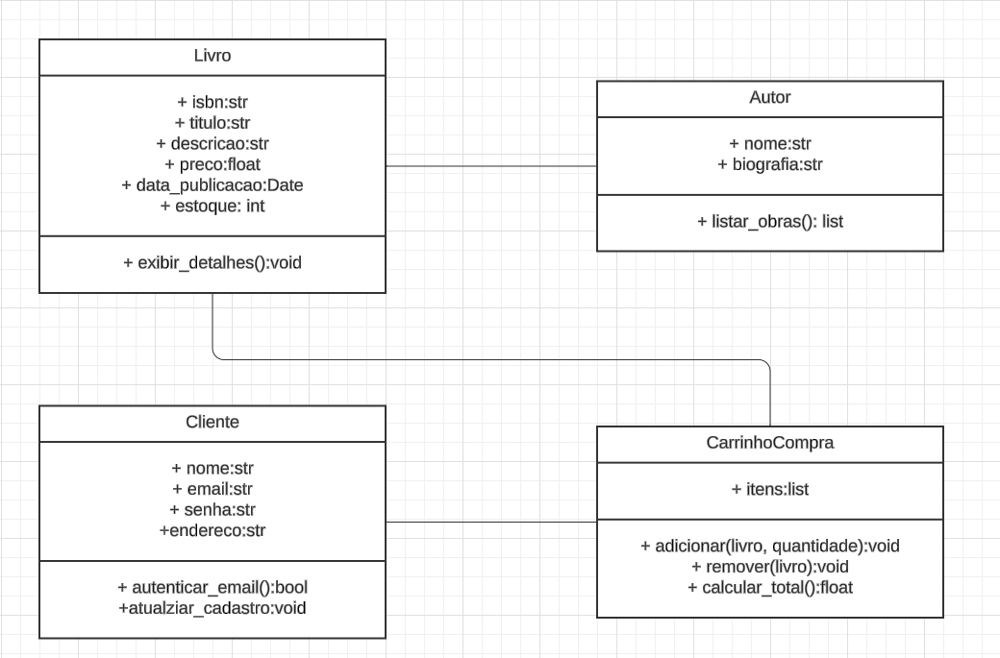

# 📚 Sistema de Livraria em Python (POO)

Este projeto simula uma **livraria interativa via terminal**, com funcionalidades como:
- Gerenciamento de livros e autores
- Carrinho de compras com controle de estoque
- Menu de interação com o usuário
- Estrutura orientada a objetos
- Estrutura pronta para cadastro e autenticação de clientes

---

## 🖼️ Visão geral



---

## 📁 Estrutura do Projeto

```
LIVRARIA/
├── __init__.py
├── .gitignore
├── 01_livraria.png           # Imagem ilustrativa do projeto
├── autor.py                  # Classe Autor
├── carrinho_compra.py        # Classe CarrinhoCompra
├── cliente.py                # Classe Cliente
├── livro.py                  # Classe Livro
├── main.py                   # Execução do sistema e menu
└── readme.md
```

---

## ✅ Funcionalidades implementadas

### 📕 Livro
- Cadastro de livros com título, ISBN, descrição, preço, ano, estoque e autor.
- Armazenamento em lista de instâncias.

### 🖋️ Autor
- Armazena nome e biografia do autor.

### 🛒 Carrinho de Compra
- Adição e remoção de livros com verificação de estoque
- Cálculo do total da compra

### 📋 Menu principal
- Listar livros disponíveis
- Adicionar livros ao carrinho
- Ver carrinho:
  - Remover item
  - Finalizar compra
  - Cancelar e voltar

### 👤 Cliente
Atributos:
- Cadastro de clientes como nome, email, senha, endereço
  - Autenticar email
  - Atualizar cadastro'

---

## ⚙️ Tecnologias

- Python 3.12+
- Programação Orientada a Objetos
- Interface via terminal

---

## 🚀 Como executar

A partir da pasta raiz do projeto:

```bash
python3 -m main
```

Ou:

```bash
python main.py
```
